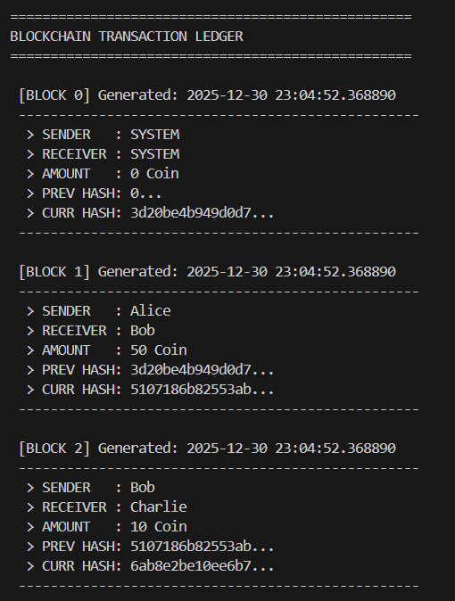
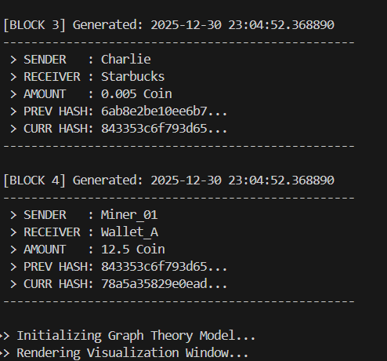
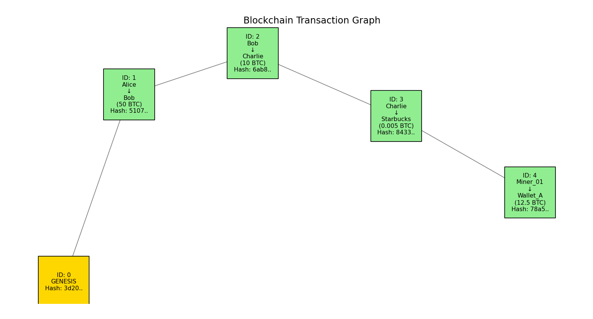

# Visual Blockchain System (Graph Theory Implementation)

## Student Declaration & Attribution

**Project Type:** Blockchain System  
Original Logic combined with Library Implementation

- **Core Algorithms:** Original implementation of SHA-256 block linking logic.
- **Visualization:** Uses `networkx` and `matplotlib` to render a Directed Acyclic Graph (DAG).
- **Code Status:** Fully self-written and annotated. No direct copy-paste from external repositories.

## Project Overview

This project is a Python-based simulation of a blockchain ledger.  
It does not rely only on terminal output.  
It integrates data visualization to display the blockchain as a directed graph.

The system demonstrates how Genesis Blocks, hashes, and transaction data are cryptographically linked to form an immutable chain.

## Key Features

- **Visual Graph Rendering**  
  Uses `networkx` to draw nodes and edges.  
  This makes block linking visible and easy to understand.

- **Cryptographic Integrity**  
  Uses `hashlib.sha256` to generate unique block hashes.

- **Structured Transaction Data**  
  Simulates a financial ledger.  
  Uses Python dictionaries with sender, receiver, and amount.  
  Converts data to JSON before hashing.

## System Requirements

This project requires external libraries for visualization.

- Python 3.x
- Dependencies:
  - networkx
  - matplotlib

Install dependencies using pip before running the program.

## How to Run

### Step 1. Launch the Script

Navigate to the project directory and run:

python blockchain.py

### Step 2. Observe the Output

The program performs two actions at the same time.

1. **Terminal Output**  
   Displays detailed ledger logs.
2. **Popup Window**  
   Shows the blockchain structure as a graph.

## Understanding the Output

### 1. Terminal Ledger Output

The terminal shows the raw proof of data integrity.

Example output:

This confirms that the previous hash of the current block matches the hash of the previous block.  
It proves the chain integrity mathematically.

### 2. Graph Visualization Output

A window opens showing connected blocks as nodes.

- **Gold Node**  
  Represents the Genesis Block.  
  This is Block 0.

- **Green Nodes**  
  Represent transaction blocks.

- **Arrows**  
  Represent hash pointers.  
  An arrow from Block 0 to Block 1 shows cryptographic dependency.

## Technical Explanation

The system relies on the avalanche effect of the SHA-256 algorithm.

Hash calculation formula:

**Hash = SHA256(Index + Timestamp + JSON(Data) + PreviousHash)**

Because `PreviousHash` is included in the hash calculation, any change to a past block changes its hash.  
This causes all subsequent blocks to become invalid.

This project demonstrates that effect clearly through both text output and visual graphs.

## References & Research
This project implementation was guided by the following academic research and technical articles:

* **Visualization Logic:**
  * *Graph Visualization for Blockchain Data* (Cornell University / arXiv)
  * [https://arxiv.org/abs/2403.03504](https://arxiv.org/abs/2403.03504)

* **Cryptographic Standard:**
  * *Application of SHA256 Hashing Algorithm in Blockchain-Based Trustless Transaction* (ResearchGate)
  * [https://www.researchgate.net/publication/328686694](https://www.researchgate.net/publication/328686694_Application_of_SHA256_Hashing_Algorithm_in_Blockchain-Based_Trustless_Transaction)

* **Data Structure Theory:**
  * *DAG vs Blockchain: Comparing Efficiency and Architecture*
  * [https://crustlab.com/blog/dag-vs-blockchain/](https://crustlab.com/blog/dag-vs-blockchain/)
